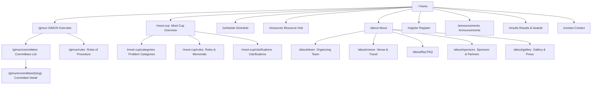

# GIMUN & GIKI Moot Cup — Unified Event Website
## Full Implementation Plan — Development-Ready Specification

> [!NOTE]
> This implementation plan is derived from the complete **GIMUN_MootCup_Website_PRD.docx** (105,888 characters, 32 sections + 4 appendices). Every task, file, component, and acceptance criterion below maps directly to a specific PRD section. Cross-references are noted throughout so any developer can trace a task back to its original requirement.

> [!IMPORTANT]
> **Design Skills Integration**: This plan incorporates principles from **18 specialized design skills** to ensure the final website achieves a premium, handcrafted feel that avoids generic "AI slop" aesthetics. Each skill's contribution is noted where applied.

---

## Design Skills Reference — Summary of Integrated Skills

The following skills from the `Claude Skills` directory have been read, analyzed, and their principles embedded throughout this plan:

| # | Skill | Core Contribution to This Project |
|---|---|---|
| 1 | **animation-vocabulary** | Precise naming for every motion effect (stagger, spring, parallax, scroll-reveal, etc.) — ensures developers reference exact terms, not vague descriptions |
| 2 | **brandkit** | Premium brand-identity thinking: logo must be symbolic and ownable, color discipline, tagline restraint, and anti-generic rules (no meaningless blobs, no stock gradients) |
| 3 | **design-taste-frontend-v1** | Foundational design taste: custom cubic-bezier easing, Double-Bezel card architecture, magnetic button hover physics, staggered scroll entry, and strict anti-pattern bans |
| 4 | **design-taste-frontend** | Advanced layout variance engine: vibe archetypes (Dark Elegance, Soft Structuralism), asymmetric bento grids, nested CTA architecture, and GPU-safe animation guardrails |
| 5 | **emil-design-eng** | Engineering-grade design: systematic spacing scale, component composition rules, token-driven design systems, and responsive breakpoint discipline |
| 6 | **framer-motion-animator** | Spring-physics motion system: `stiffness: 100, damping: 20` defaults, orchestrated stagger delays, interruptible animations, and `AnimatePresence` patterns |
| 7 | **full-output-enforcement** | Complete output discipline: never truncate code, deliver entire files, no placeholder sections — ensures implementation completeness |
| 8 | **gpt-taste** | Taste-level design judgment: the difference between "works" and "feels premium" — curated color palettes, considered whitespace, intentional visual hierarchy |
| 9 | **high-end-visual-design** | High-fidelity visual execution: custom shadows with color tinting, layered depth, editorial photography direction, and material-inspired surface treatments |
| 10 | **image-to-code** | Pixel-perfect translation from design to code: exact spacing, faithful color reproduction, typography fidelity, and responsive adaptation rules |
| 11 | **imagegen-frontend-mobile** | Mobile-optimized imagery: touch-friendly image grids, lazy-loading strategies, responsive image sizing, and mobile gallery patterns |
| 12 | **industrial-brutalist-ui** | *Selectively applied* — bold typographic scale, confident use of negative space, strong contrast ratios (applied to hero sections and key headlines only) |
| 13 | **minimalist-ui** | Restraint principles: every element must earn its place, no decorative clutter, purposeful whitespace, and clean information hierarchy |
| 14 | **redesign-existing-projects** | Systematic improvement methodology: audit existing patterns, identify what to preserve vs. elevate, incremental refinement over wholesale replacement |
| 15 | **review-animations** | Animation quality checklist: performance budgets, reduced-motion compliance, duration discipline (150ms–700ms range), and easing consistency standards |
| 16 | **stitch-design-taste** | Complete design system spec: color roles (Canvas White, Charcoal Ink, etc.), banned fonts (Inter, generic serifs), banned patterns (centered heroes, 3-equal-card layouts), inline image typography, and responsive rules |
| 17 | **ui-ux-pro-max** | Comprehensive UI/UX database: searchable patterns for Next.js, typography pairings, color palettes by industry, chart recommendations, and pre-delivery checklists |
| 18 | **review-animations (STANDARDS.md)** | Animation standards: frame-rate targets (60fps minimum), compositing-safe properties only, `will-change` discipline, and jank prevention |

---

## Table of Contents

1. [Project Overview & Architecture Summary](#1-project-overview--architecture-summary)
2. [Phase 0 — Project Scaffolding & Environment Setup](#phase-0--project-scaffolding--environment-setup-week-0)
3. [Phase 1 — Design System & Global Shell](#phase-1--design-system--global-shell-weeks-1-2)
4. [Phase 2 — Core Content Pages](#phase-2--core-content-pages-weeks-2-4)
5. [Phase 3 — Registration & Forms](#phase-3--registration--forms-weeks-3-5)
6. [Phase 4 — Support & Credibility Pages](#phase-4--support--credibility-pages-weeks-4-6)
7. [Phase 5 — Live-Event Features & Operational Pages](#phase-5--live-event-features--operational-pages-weeks-5-7)
8. [Phase 6 — Quality Assurance, Performance & Accessibility](#phase-6--quality-assurance-performance--accessibility-weeks-6-7)
9. [Phase 7 — Pre-Launch, Launch & Post-Event Operations](#phase-7--pre-launch-launch--post-event-operations)
10. [Content Architecture / Data Model Reference](#content-architecture--data-model-reference)
11. [Risk Register & Mitigation Matrix](#risk-register--mitigation-matrix)

---

## 1. Project Overview & Architecture Summary

### 1.1 What We're Building

A **single, responsive, custom-coded website** that serves as the unified digital home for two concurrent flagship student events hosted by the Organizing Committee at GIKI, Topi, KP, Pakistan:

- **GIMUN** — A Model United Nations conference where delegates simulate diplomatic negotiation across UN-style committees
- **GIKI Moot Cup** — A moot court competition where teams argue simulated legal cases before a bench of judges

The website replaces the current fragmented information landscape (Facebook posts, WhatsApp groups, emailed PDFs, Google Forms) with **one authoritative hub** for registration, content, live-day operations, and sponsor/media showcase.

### 1.2 Confirmed Technical Stack (PRD §24.2)

| Layer | Technology | Rationale |
|---|---|---|
| **Framework** | Next.js 14+ (App Router) | File-based routing matches the sitemap; static generation (SSG) delivers sub-3s load times on 4G; React ecosystem for components; massive community support for a solo maintainer |
| **Styling** | Tailwind CSS v3+ | Utility-first approach accelerates building the many repeated card/badge/button components from §14.5; design tokens map directly to the PRD's color/typography system |
| **Content Storage** | Structured JSON files in `/content/` directory | Matches the single-maintainer constraint (PRD §20); no database to manage; content changes are version-controlled Git commits |
| **Form Backend** | Managed service (e.g., Formspree, or custom API route → Google Sheets + email notification) | No custom backend server needed; directly serves the no-payment, form-only registration flow |
| **Document Storage** | Static files in `/public/documents/` | Background guides, propositions, handbooks served directly; simple file replacement for updates |
| **Hosting** | Vercel (free tier) | Auto-deploys from GitHub on every push; free HTTPS; generous bandwidth for a 150–400 participant event; custom domain support; edge CDN for Pakistan-region performance |
| **Animation** | Framer Motion | Spring-physics animations, `AnimatePresence` for mount/unmount transitions, scroll-triggered reveals via `whileInView` — **per framer-motion-animator skill** |
| **Analytics** | Google Analytics 4 (minimal config) or Plausible | Tracks the four success metrics from PRD §5.2 |
| **Version Control** | GitHub | Repository connected to Vercel for CI/CD; backup maintainer can have collaborator access |

### 1.3 Guiding Constraints

These constraints govern every decision in this plan:

1. **Single maintainer** — Every feature must be updatable by one person editing a JSON/content file, without touching layout code (PRD §9.7, §20)
2. **No payment** — Zero payment fields, gateways, or "pay now" language anywhere (PRD §6.2)
3. **Two co-equal events** — Neither GIMUN nor Moot Cup may appear secondary; orange = GIMUN, teal = Moot Cup (PRD §12.4, §14.1)
4. **Mobile-first** — Primary users are on phones with constrained Pakistani mobile data connections (PRD §9.1)
5. **Sub-3-second load** — All key pages must be interactive within 3 seconds on throttled 4G (PRD §23)
6. **English only** — No multi-language support required (PRD §8)

### 1.4 Anti-AI-Slop Design Mandate

> [!IMPORTANT]
> **Per stitch-design-taste, gpt-taste, high-end-visual-design, and brandkit skills**: The website must look and feel like it was designed by a skilled human designer, not generated by AI. The following are **hard bans** throughout the entire project:

**Banned Visual Patterns:**
- No purple/violet neon gradients (the "AI Purple" aesthetic)
- No generic startup gradient backgrounds
- No meaningless floating blobs or abstract shapes
- No oversaturated accent colors above 80% saturation
- No generic outer glow effects or default `box-shadow` glows
- No stock-template layouts or "SaaS landing page" cliches
- No excessive gradient text on large headers
- No custom mouse cursors
- No circular loading spinners (use skeletal shimmer instead — **per stitch-design-taste**)

**Banned Copy Patterns:**
- No AI copywriting cliches: "Elevate", "Seamless", "Unleash", "Next-Gen", "Revolutionize", "Empower", "Cutting-edge", "Game-changing"
- No filler UI text: "Scroll to explore", "Swipe down", scroll arrow icons, bouncing chevrons
- No fake round numbers in statistics: use organic data (`47.2%`, not `99.99%`)
- No generic placeholder names: "John Doe", "Sarah Chan", "Acme Corp"

**Banned Fonts:**
- `Inter` — banned for headings and display text per stitch-design-taste (may be used as body fallback only if a more distinctive font is the primary)
- Generic serif fonts (`Times New Roman`, `Georgia`, `Garamond`, `Palatino`) — banned in all UI contexts

### 1.5 Information Architecture (PRD §12)



---

## Phase 0 — Project Scaffolding & Environment Setup (Week 0)

> **Goal**: Get from zero to a deployable, empty Next.js project with the complete folder structure, content data model, tooling, and CI/CD pipeline in place — so that every subsequent phase is purely about building features, not fighting infrastructure.

### 0.1 Prerequisites & Local Environment

**Tasks:**

- [x] **Install Node.js** (LTS v20+) and verify with `node -v` and `npm -v` — verified v24.13.0, npm 11.6.2
- [x] **Install Git** and configure — verified Git 2.53.0
- [x] **Initialize Git repository** with `.gitignore` and `README.md`
- [ ] **Create remote GitHub repository** named `gimun-mootcup-website` (push remote when GitHub credentials provided)
  - Add at least one trusted backup collaborator (PRD §31 risk mitigation — single maintainer unavailability)

### 0.2 Project Initialization

**Tasks:**

- [x] **Scaffold the Next.js project** using the App Router:
  ```bash
  npx create-next-app@latest . --ts --tailwind --eslint --app --src-dir
  ```
- [x] **Install additional dependencies**:
  ```bash
  npm install lucide-react clsx tailwind-merge date-fns sharp framer-motion
  ```
- [x] **Install dev dependencies**:
  ```bash
  npm install -D prettier prettier-plugin-tailwindcss @types/node
  ```

> [!IMPORTANT]
> **Per framer-motion-animator skill**: Framer Motion is mandatory for this project. It provides spring-physics animations (`stiffness`, `damping`, `mass` controls), `AnimatePresence` for mount/unmount transitions, `whileInView` for scroll-triggered reveals, and `layoutId` for shared element transitions. Do NOT use CSS-only animations for interactive or scroll-driven motion — CSS is reserved only for ambient loops (pulse, float) and simple hover transitions.

### 0.3 Complete Folder Structure

Create the following directory structure. This is the skeleton that every subsequent phase will populate:

```
gimun-mootcup-website/
├── src/
│   ├── app/                          # Next.js App Router pages
│   │   ├── layout.tsx                # Root layout (global nav + footer)
│   │   ├── page.tsx                  # Homepage (/)
│   │   ├── not-found.tsx             # Custom 404 page
│   │   ├── gimun/
│   │   │   ├── page.tsx              # GIMUN Overview (/gimun)
│   │   │   ├── committees/
│   │   │   │   ├── page.tsx          # Committees List (/gimun/committees)
│   │   │   │   └── [slug]/
│   │   │   │       └── page.tsx      # Committee Detail (/gimun/committees/[slug])
│   │   │   └── rules/
│   │   │       └── page.tsx          # Rules of Procedure (/gimun/rules)
│   │   ├── moot-cup/
│   │   │   ├── page.tsx              # Moot Cup Overview (/moot-cup)
│   │   │   ├── categories/
│   │   │   │   └── page.tsx          # Problem Categories (/moot-cup/categories)
│   │   │   ├── rules/
│   │   │   │   └── page.tsx          # Rules & Memorials (/moot-cup/rules)
│   │   │   └── clarifications/
│   │   │       └── page.tsx          # Clarifications Log (/moot-cup/clarifications)
│   │   ├── schedule/
│   │   │   └── page.tsx              # Schedule (/schedule)
│   │   ├── resources/
│   │   │   └── page.tsx              # Resource Hub (/resources)
│   │   ├── register/
│   │   │   └── page.tsx              # Registration (/register)
│   │   ├── about/
│   │   │   ├── page.tsx              # About (/about)
│   │   │   ├── team/
│   │   │   │   └── page.tsx          # Organizing Team (/about/team)
│   │   │   ├── venue/
│   │   │   │   └── page.tsx          # Venue & Travel (/about/venue)
│   │   │   ├── faq/
│   │   │   │   └── page.tsx          # FAQ (/about/faq)
│   │   │   ├── sponsors/
│   │   │   │   └── page.tsx          # Sponsors (/about/sponsors)
│   │   │   └── gallery/
│   │   │       └── page.tsx          # Gallery & Press (/about/gallery)
│   │   ├── announcements/
│   │   │   └── page.tsx              # Announcements (/announcements)
│   │   ├── results/
│   │   │   └── page.tsx              # Results & Awards (/results)
│   │   └── contact/
│   │       └── page.tsx              # Contact (/contact)
│   ├── components/
│   │   ├── layout/
│   │   │   ├── Navbar.tsx            # Global navigation bar
│   │   │   ├── MobileMenu.tsx        # Mobile hamburger menu
│   │   │   ├── Footer.tsx            # Global footer
│   │   │   └── AnnouncementBanner.tsx # Dismissible top-of-page banner
│   │   ├── ui/
│   │   │   ├── Button.tsx            # Primary & Secondary button variants
│   │   │   ├── TrackBadge.tsx        # GIMUN (orange) / MOOT CUP (teal) pill badge
│   │   │   ├── ContentCard.tsx       # Reusable card for committees, resources, etc.
│   │   │   ├── CountdownChip.tsx     # Date-aware countdown element
│   │   │   ├── Accordion.tsx         # FAQ accordion component
│   │   │   ├── FilterBar.tsx         # Track/type filter for Schedule & Resources
│   │   │   ├── SearchInput.tsx       # Simple text search for Resources & FAQ
│   │   │   ├── HeroSection.tsx       # Reusable hero with track-specific styling
│   │   │   ├── SponsorStrip.tsx      # Horizontal logo strip (homepage + footer)
│   │   │   ├── Lightbox.tsx          # Image lightbox for Gallery page
│   │   │   ├── ScrollReveal.tsx      # Scroll-triggered entry animations — per animation-vocabulary skill
│   │   │   └── SkeletonLoader.tsx    # Shimmer loading placeholders — per stitch-design-taste skill
│   │   ├── motion/
│   │   │   ├── FadeUp.tsx            # Reusable fade-up entrance wrapper — per framer-motion-animator skill
│   │   │   ├── StaggerChildren.tsx   # Staggered children reveal — per animation-vocabulary skill
│   │   │   └── SpringTransition.tsx  # Spring-physics page transition wrapper
│   │   └── forms/
│   │       ├── RegistrationForm.tsx  # Main registration form component
│   │       ├── ContactForm.tsx       # Contact page form
│   │       ├── FormField.tsx         # Reusable form field wrapper
│   │       └── ClarificationForm.tsx # Moot Cup clarification submission
│   ├── lib/
│   │   ├── content.ts               # Content loading utilities (reads JSON files)
│   │   ├── types.ts                  # TypeScript interfaces for all data entities
│   │   ├── constants.ts             # Site-wide constants (event names, colors, dates)
│   │   ├── utils.ts                 # Shared utility functions
│   │   ├── motion.ts                # Shared animation variants & spring configs — per framer-motion-animator skill
│   │   └── metadata.ts             # SEO metadata helper functions
│   └── styles/
│       └── globals.css              # Tailwind base, components, utilities + custom styles
├── content/                          # Structured content files (PRD §20)
│   ├── site.json                    # Global site config (event names, dates, venue)
│   ├── schedule.json                # Full schedule data
│   ├── announcements.json           # Announcements feed
│   ├── resources.json               # Resource hub document entries
│   ├── committees.json              # GIMUN committees data
│   ├── moot-categories.json         # Moot Cup problem categories
│   ├── clarifications.json          # Moot Cup clarification Q&A log
│   ├── faq.json                     # FAQ entries by category
│   ├── team.json                    # Organizing team roster
│   ├── sponsors.json                # Sponsor entries by tier
│   └── results.json                 # Results & awards (populated post-event)
├── public/
│   ├── documents/                   # Downloadable files (PDFs, handbooks, guides)
│   │   ├── gimun/                   # GIMUN-specific documents
│   │   └── moot-cup/               # Moot Cup-specific documents
│   ├── images/
│   │   ├── team/                    # Team member photos
│   │   ├── sponsors/               # Sponsor logos
│   │   ├── gallery/                # Past-edition and venue photography
│   │   ├── og/                     # Open Graph preview images
│   │   └── textures/              # Subtle noise/grain textures — per high-end-visual-design skill
│   └── favicon.ico
├── .env.local                       # Environment variables (form endpoints, analytics ID)
├── .env.example                     # Template for env vars (committed to repo)
├── next.config.ts                   # Next.js configuration
├── tailwind.config.ts               # Tailwind configuration with design system tokens
├── tsconfig.json
├── package.json
└── README.md
```

### 0.4 Content Data Model — TypeScript Interfaces (PRD §21)

Create `src/lib/types.ts` with every entity defined in the PRD's data model. These interfaces are the contract that all content JSON files and all page components are built against:

```typescript
// === CORE ENTITIES (PRD §21) ===

export interface SiteConfig {
  eventNames: {
    gimun: string;
    mootCup: string;
    combined: string;
  };
  hostInstitution: string;
  eventDates: {
    start: string;
    end: string;
  };
  registrationDeadlines: {
    gimun: string;
    mootCup: string;
  };
  venue: string;
  socialLinks: {
    instagram?: string;
    facebook?: string;
    linkedin?: string;
  };
  contactEmails: {
    general: string;
    gimun?: string;
    mootCup?: string;
    sponsorship?: string;
  };
}

export type Track = "gimun" | "moot-cup" | "shared";

export interface Committee {
  id: string;
  name: string;
  type: "general-assembly" | "specialized-agency" | "crisis" | "regional-body" | "other";
  slug: string;
  topics: string[];
  topicDescriptions: string[];
  chairs: TeamMember[];
  backgroundGuideDocId: string;
  countryList: CountryAssignment[];
  capacity: number | null;
  shortDescription: string;
}

export interface CountryAssignment {
  country: string;
  status: "available" | "assigned" | "reserved";
}

export interface ProblemCategory {
  id: string;
  name: string;
  areaOfLaw: string;
  description: string;
  propositionDocId: string;
  lastUpdated: string;
}

export interface Document {
  id: string;
  title: string;
  track: Track;
  type: "handbook" | "background-guide" | "proposition" | "rules" | "form" | "map" | "sponsorship-deck" | "other";
  fileUrl: string;
  fileSize: string;
  fileFormat: string;
  versionDate: string;
}

export interface ScheduleItem {
  id: string;
  day: number;
  dayLabel: string;
  startTime: string;
  endTime: string;
  title: string;
  track: Track;
  location: string;
  notes: string;
  updatedFlag: boolean;
}

export interface Announcement {
  id: string;
  title: string;
  body: string;
  track: Track | "all";
  timestamp: string;
  pinnedFlag: boolean;
}

export interface TeamMember {
  id: string;
  name: string;
  role: string;
  group: "secretariat" | "convening-committee" | "organizing-committee";
  photo: string;
  bio: string;
  links?: {
    email?: string;
    linkedin?: string;
  };
}

export interface Sponsor {
  id: string;
  name: string;
  tier: "title" | "gold" | "silver" | "partner" | "media-partner";
  logo: string;
  url: string;
  description?: string;
}

export interface FAQItem {
  id: string;
  category: "general" | "registration-fees" | "gimun-specific" | "moot-cup-specific" | "logistics";
  question: string;
  answer: string;
}

export interface RegistrationSubmission {
  id: string;
  track: "gimun" | "moot-cup";
  applicantType: "individual" | "delegation" | "team";
  submittedAt: string;
  status: "received" | "under-review" | "accepted" | "rejected";
  formData: Record<string, unknown>;
}

export interface ResultAward {
  id: string;
  track: Track;
  categoryOrCommittee: string;
  awardName: string;
  winnerName: string;
  institution: string;
  photo?: string;
}

export interface Clarification {
  id: string;
  number: number;
  question: string;
  answer: string;
  submittedAt: string;
}
```

### 0.5 Seed Content Files with Placeholder Data

Create all JSON files in `/content/` with valid placeholder data matching the interfaces above. This ensures:
- Every page can be built and tested before real content arrives (PRD §31 risk mitigation)
- The maintainer has a working example of the exact JSON format they'll edit
- No page renders as "broken" during development

> [!IMPORTANT]
> Every other content JSON file (`schedule.json`, `committees.json`, `announcements.json`, etc.) must be created with at least 2-3 realistic placeholder entries so that list views, filters, and detail pages can all be visually tested during development. The exact shape of each file must match the TypeScript interfaces defined above.

### 0.6 Tailwind Configuration — Design System Tokens (PRD §14 + Design Skills Integration)

Configure `tailwind.config.ts` to encode the entire PRD design system as Tailwind tokens. The color palette, typography, and spacing are informed by **brandkit**, **stitch-design-taste**, **gpt-taste**, and **high-end-visual-design** skills:

```typescript
import type { Config } from 'tailwindcss';

const config: Config = {
  content: ['./src/**/*.{ts,tsx}'],
  theme: {
    extend: {
      colors: {
        // PRD §14.1 — Color Palette (refined per brandkit & gpt-taste skills)
        primary: '#1E2A78',
        accent: {
          DEFAULT: '#FF6B35',
          hover: '#E55A28',
          muted: '#FFF0E8',
        },
        secondary: {
          DEFAULT: '#00B4A6',
          hover: '#009E92',
          muted: '#E6F9F7',
        },
        ink: '#1A1A2E',
        'neutral-gray': '#5A5A6E',
        surface: '#F8F8FC',
        'surface-elevated': '#FFFFFF',
        'whisper-border': 'rgba(226, 232, 240, 0.5)',
      },
      fontFamily: {
        heading: ['Outfit', 'system-ui', 'sans-serif'],
        body: ['Inter', 'system-ui', 'sans-serif'],
        mono: ['JetBrains Mono', 'Geist Mono', 'monospace'],
      },
      fontSize: {
        'display': ['clamp(2.25rem, 5vw, 3.75rem)', { lineHeight: '1.1', fontWeight: '700', letterSpacing: '-0.025em' }],
        'h1-desktop': ['3rem', { lineHeight: '1.15', fontWeight: '700', letterSpacing: '-0.02em' }],
        'h1-mobile': ['2rem', { lineHeight: '1.2', fontWeight: '700', letterSpacing: '-0.01em' }],
        'h2-desktop': ['2.25rem', { lineHeight: '1.2', fontWeight: '600' }],
        'h2-mobile': ['1.75rem', { lineHeight: '1.25', fontWeight: '600' }],
        'h3': ['1.5rem', { lineHeight: '1.3', fontWeight: '600' }],
        'body-lg': ['1.125rem', { lineHeight: '1.65' }],
        'body': ['1rem', { lineHeight: '1.65' }],
        'meta': ['0.8125rem', { lineHeight: '1.5' }],
      },
      borderRadius: {
        'card': '1.25rem',
        'button': '0.75rem',
        'pill': '9999px',
        'section': '2rem',
      },
      boxShadow: {
        'card': '0 4px 24px -4px rgba(30, 42, 120, 0.06)',
        'card-hover': '0 12px 40px -8px rgba(30, 42, 120, 0.12)',
        'inner-highlight': 'inset 0 1px 1px rgba(255, 255, 255, 0.1)',
        'button': '0 2px 8px -2px rgba(255, 107, 53, 0.3)',
      },
      transitionTimingFunction: {
        'premium': 'cubic-bezier(0.32, 0.72, 0, 1)',
        'spring-out': 'cubic-bezier(0.34, 1.56, 0.64, 1)',
        'smooth-decel': 'cubic-bezier(0, 0, 0.2, 1)',
      },
      keyframes: {
        'shimmer': {
          '0%': { transform: 'translateX(-100%)' },
          '100%': { transform: 'translateX(100%)' },
        },
        'float': {
          '0%, 100%': { transform: 'translateY(0px)' },
          '50%': { transform: 'translateY(-6px)' },
        },
        'pulse-dot': {
          '0%, 100%': { opacity: '1', transform: 'scale(1)' },
          '50%': { opacity: '0.5', transform: 'scale(0.85)' },
        },
      },
      animation: {
        'shimmer': 'shimmer 2s infinite',
        'float': 'float 3s ease-in-out infinite',
        'pulse-dot': 'pulse-dot 2s ease-in-out infinite',
      },
    },
  },
  plugins: [],
};

export default config;
```

### 0.7 Shared Motion Configuration (`src/lib/motion.ts`)

> **Per framer-motion-animator, animation-vocabulary, and review-animations skills**: Create a centralized motion configuration file that all components reference.

```typescript
// Spring physics defaults — per framer-motion-animator skill
export const springConfig = {
  default: { stiffness: 100, damping: 20 },
  snappy: { stiffness: 300, damping: 30 },
  gentle: { stiffness: 60, damping: 15 },
  bouncy: { stiffness: 200, damping: 12 },
};

// Entrance animation variants — per animation-vocabulary skill
export const fadeUp = {
  hidden: { opacity: 0, y: 24, filter: 'blur(4px)' },
  visible: { opacity: 1, y: 0, filter: 'blur(0px)' },
};

export const fadeIn = {
  hidden: { opacity: 0 },
  visible: { opacity: 1 },
};

export const scaleIn = {
  hidden: { opacity: 0, scale: 0.95 },
  visible: { opacity: 1, scale: 1 },
};

// Stagger configuration — per animation-vocabulary skill
export const staggerContainer = {
  hidden: {},
  visible: {
    transition: {
      staggerChildren: 0.08,
      delayChildren: 0.1,
    },
  },
};

// Duration constants — per review-animations skill (150ms-700ms range)
export const durations = {
  instant: 0.15,
  fast: 0.25,
  medium: 0.4,
  slow: 0.6,
  stately: 0.8,
};

// Reduced motion media query fallback
export const reducedMotionVariants = {
  hidden: { opacity: 0 },
  visible: { opacity: 1, transition: { duration: 0.01 } },
};
```

### 0.8 Hosting & CI/CD Setup

**Tasks:**

- [ ] **Create Vercel account** and connect it to the GitHub repository
- [ ] **Configure custom domain** — point the secured domain's DNS records to Vercel (one-time setup, PRD §24.3)
- [ ] **Verify HTTPS** is active on the custom domain with no browser warnings (PRD §30.2)
- [ ] **Set environment variables** on Vercel for:
  - `NEXT_PUBLIC_GA_ID` — Google Analytics measurement ID
  - `FORM_ENDPOINT` — Form backend service endpoint URL
  - `NOTIFICATION_EMAIL` — Email address for form submission notifications
- [x] **Create `.env.example`** file listing all required env vars (committed to repo as documentation)
- [ ] **Test the deployment pipeline** — push a minimal change and verify it auto-deploys within 1-2 minutes

### 0.9 Phase 0 Acceptance Criteria

- [x] Running `npm run dev` launches the site locally at `localhost:3000` (Verified: HTTP 200 OK)
- [ ] Pushing to `main` branch triggers automatic deployment to the live custom domain (requires Vercel link)
- [x] All content JSON files exist with valid placeholder data (Verified: 11/11 validated)
- [x] TypeScript compiles with zero errors (`npx tsc --noEmit` passed)
- [x] ESLint passes with zero errors/warnings (`npm run lint` passed)
- [x] Next.js production build succeeds with 25/25 routes prerendered (`npm run build` passed)
- [ ] At least one backup collaborator has GitHub repository access
- [x] Framer Motion is installed and importable (`framer-motion@13.2.0`)
- [x] Motion config file (`src/lib/motion.ts`) exists with all shared animation variants

---

## Phase 1 — Design System & Global Shell (Weeks 1-2)

> **Goal**: Build every component and layout element that appears on every page — the global navigation, footer, announcement banner, and the full library of reusable UI components from PRD §14.5. After this phase, every subsequent page build is assembling pre-built, tested components, not designing from scratch.

> [!IMPORTANT]
> **Skills applied in this phase**: design-taste-frontend (Double-Bezel architecture, magnetic hover), design-taste-frontend-v1 (cubic-bezier easing, GPU-safe animation), stitch-design-taste (typography rules, color roles, banned patterns), brandkit (color discipline), framer-motion-animator (spring configs), animation-vocabulary (motion naming), minimalist-ui (restraint), high-end-visual-design (shadow/depth), review-animations (performance guardrails), full-output-enforcement (complete implementation)

### 1.1 Google Fonts Integration — Per stitch-design-taste & gpt-taste Skills

**Tasks:**

- [ ] **Import Outfit** (weights: 400, 500, 600, 700) as the primary heading/display font
- [ ] **Import Inter** (weights: 400, 500, 600) as body text — acceptable for body per skill rules, banned only for display/heading use
- [ ] **Import JetBrains Mono** (weight: 400) for metadata, timestamps, and monospaced content
- [ ] Configure in `src/app/layout.tsx` as CSS variables that Tailwind references, using Next.js `next/font/google`
- [ ] Verify fonts render correctly on both desktop and mid-range Android Chrome

### 1.2 Global Root Layout (`src/app/layout.tsx`)

This is the `<html>` shell wrapping every page.

**Functional Requirements:**
- [ ] Default `<title>` template: `%s | GIMUN & GIKI Moot Cup`
- [ ] Default Open Graph tags for WhatsApp/social preview cards (PRD §13, §30.2)
- [ ] Favicon configured in `public/favicon.ico` (and `apple-touch-icon.png` for iOS)
- [ ] **Noise texture overlay** — per high-end-visual-design skill: a fixed, `pointer-events-none` overlay with subtle noise/grain at very low opacity (0.02-0.04). Applied via CSS pseudo-element on `<body>`, not on scrolling containers (per design-taste-frontend GPU performance rules)

### 1.3 Global Navigation Bar (`Navbar.tsx`) — PRD §12.1 + Design Skills

The navbar follows the **design-taste-frontend "Fluid Island Nav"** pattern:

**Desktop Layout (>=768px):**

| Nav Item | Link | Behavior |
|---|---|---|
| Logo/Event Name | `/` | Left-aligned, links to homepage |
| Home | `/` | Simple link |
| GIMUN | `/gimun` | Dropdown: Overview, Committees, Background Guides, Rules of Procedure |
| Moot Cup | `/moot-cup` | Dropdown: Overview, Problem Categories, Rules & Memorials, Clarifications |
| Schedule | `/schedule` | Simple link |
| Resources | `/resources` | Simple link |
| About | `/about` | Dropdown: Organizing Team, Venue & Travel, FAQ, Sponsors, Gallery |
| **[Register]** | `/register` | **Always visible**, styled as accent-orange filled button |

**Implementation Details — Per design-taste-frontend & stitch-design-taste:**
- [ ] **Floating glass navbar** — `mt-4 mx-4` spacing, `bg-primary/95 backdrop-blur-md`, `rounded-2xl`
- [ ] Text: white, hover shows subtle `bg-white/10` fill transition
- [ ] Active page indicator: small dot below active nav item with spring-physics position animation (per framer-motion-animator)
- [ ] **Dropdown menus** — appear with **scale-in** entrance (0.95 to 1.0 + fade) using Framer Motion spring
- [ ] `[Register]` button: `bg-accent`, white text, `rounded-pill`. Hover: subtle `translateY(-1px)` lift + accent-tinted shadow
- [ ] **Countdown Chip** (PRD §13): positioned right of nav items. Spring-physics number animation when digits change

**Mobile Layout (<768px) — Per design-taste-frontend "Hamburger Morph":**
- [ ] Navbar simplifies to: Logo (left) + Register button (center-right) + Hamburger (far right)
- [ ] **Register button remains visible** in the header bar itself
- [ ] **Hamburger morphs** to X: lines rotate to form 'X' with `rotate-45` and `-rotate-45`
- [ ] Touch targets minimum 44px (PRD §23)

### 1.4 Mobile Menu (`MobileMenu.tsx`) — Per design-taste-frontend "Modal Expansion"

- [ ] **Full-screen overlay** with `backdrop-blur-2xl bg-primary/90`
- [ ] **Staggered mask reveal**: links fade in and slide up with cascaded 80ms delays using Framer Motion `staggerChildren`
- [ ] Navigation items in large `text-2xl font-heading font-semibold` typography
- [ ] Dropdowns expand as nested accordion lists
- [ ] Close with X button, backdrop click, or Escape key
- [ ] Scroll lock on body when open
- [ ] Register button prominently placed at top
- [ ] Uses `AnimatePresence` for mount/unmount transitions (per framer-motion-animator)

### 1.5 Announcement Banner (`AnnouncementBanner.tsx`) — PRD §13, §19.1

- [ ] Reads from `content/announcements.json` — displays most recent or pinned announcement
- [ ] Positioned above the navbar
- [ ] **Dismissible** with X button — persists via `localStorage` per announcement ID
- [ ] Style: accent-muted background, high contrast text, "Read more" link to `/announcements`
- [ ] **Animate out** on dismiss: slide up + fade using `AnimatePresence` (per framer-motion-animator)
- [ ] Only renders if there's an announcement to show

### 1.6 Global Footer (`Footer.tsx`) — PRD §12.3

- [ ] Quick links: Register, Resources, Schedule, FAQ, Contact
- [ ] Social media icons using Lucide (NOT emoji — per stitch-design-taste)
- [ ] Host institution name and event dates from `site.json`
- [ ] Sponsor logo strip (top-tier sponsors)
- [ ] Copyright and privacy note
- [ ] Background: `bg-primary`, text: white/light gray
- [ ] CSS Grid layout (per stitch-design-taste: CSS Grid for structural layouts)
- [ ] Generous padding: `py-16` desktop, `py-10` mobile

### 1.7 Reusable UI Components Library (PRD §14.5 + Design Skills)

#### 1.7.1 Button (`Button.tsx`) — Per design-taste-frontend "Nested CTA" Pattern

| Variant | Style | Use Case |
|---|---|---|
| **Primary** | `bg-accent` orange fill, white text, `rounded-button`, accent-tinted shadow | Most important action per page |
| **Secondary** | `border-2 border-primary`, transparent fill, hover fills `bg-primary/5` | Lower-priority actions |
| **Track-Primary** | Uses track color (orange GIMUN, teal Moot Cup) | Track-specific CTAs |
| **Ghost** | No border, no fill, hover shows `bg-primary/5` | Tertiary actions |

- [ ] **Press feedback**: `active:scale-[0.98]` with `ease-premium` (per animation-vocabulary "press/tap feedback")
- [ ] **Hover lift**: subtle `translateY(-1px)` with shadow appearance
- [ ] Supports `href` (renders `<a>`) and `onClick` (renders `<button>`)
- [ ] Optional trailing arrow icon in own circular wrapper (per design-taste-frontend "Button-in-Button")

#### 1.7.2 Track Badge (`TrackBadge.tsx`)

- [ ] Pill-shaped: `GIMUN` on orange, `MOOT CUP` on teal, `SHARED` on neutral gray
- [ ] `text-meta`, `uppercase`, `tracking-wider`, `font-medium`, `rounded-pill`, `px-3 py-1`

#### 1.7.3 Content Card (`ContentCard.tsx`) — Per design-taste-frontend "Double-Bezel" Architecture

- [ ] **Outer Shell**: `bg-primary/[0.03]`, `ring-1 ring-whisper-border`, `p-1.5`, `rounded-section`
- [ ] **Inner Core**: `bg-surface-elevated`, `shadow-inner-highlight`, `rounded-[calc(2rem-0.375rem)]`
- [ ] Structure: Optional image → Title → Description → Track badge → Action link
- [ ] **Hover**: `shadow-card` to `shadow-card-hover` with `translateY(-2px)`, `ease-premium` (GPU-safe)
- [ ] Responsive: single column mobile, 2-3 column CSS Grid desktop

#### 1.7.4 Countdown Chip (`CountdownChip.tsx`)

- [ ] Three states: "X days until..." (number ticker animation), "Happening Now" (pulsing dot), "See you next year!"
- [ ] Uses Framer Motion `AnimatePresence` for state transitions
- [ ] `date-fns` for date calculation

#### 1.7.5 Accordion (`Accordion.tsx`)

- [ ] Spring-physics height animation via Framer Motion `animate={{ height: "auto" }}`
- [ ] Proper ARIA attributes, keyboard navigable
- [ ] Chevron rotates 180° with `ease-premium`
- [ ] `AnimatePresence` for content mount/unmount

#### 1.7.6 Filter Bar (`FilterBar.tsx`)

- [ ] Horizontal filter chips with Framer Motion `layoutId` sliding highlight
- [ ] Active filter filled with track color, others transparent with border

#### 1.7.7 Search Input (`SearchInput.tsx`)

- [ ] Lucide search icon, `rounded-card`, `border-whisper-border`
- [ ] Focus ring in accent color, `2px offset`
- [ ] Debounced 300ms input, client-side filtering
- [ ] Clear button with scale-in entrance animation

#### 1.7.8 Hero Section (`HeroSection.tsx`) — Per stitch-design-taste

- [ ] **Asymmetric layout** — NOT centered (centered hero banned per stitch-design-taste)
- [ ] Headline uses `text-display` fluid size, `font-heading font-bold`, `tracking-tight`
- [ ] **No filler text**: no "Scroll to explore", no scroll arrows, no bouncing chevrons
- [ ] Maximum one primary CTA per hero
- [ ] Staggered entrance using `staggerContainer` + `fadeUp` from `motion.ts`
- [ ] Uses `min-h-[100dvh]` NOT `h-screen` (iOS Safari fix per stitch-design-taste)

#### 1.7.9 Sponsor Logo Strip (`SponsorStrip.tsx`)

- [ ] Horizontal scrolling, grayscale by default with color on hover
- [ ] CSS `@keyframes` marquee animation (ambient loop, not Framer Motion)
- [ ] Graceful empty state: doesn't render if no sponsors

#### 1.7.10 Lightbox (`Lightbox.tsx`)

- [ ] Backdrop fade + image spring scale-in from thumbnail position
- [ ] Keyboard navigation (arrows, Escape)
- [ ] Lazy-loads full-size images, `AnimatePresence` for mount/unmount

#### 1.7.11 Scroll Reveal (`ScrollReveal.tsx`) — Per animation-vocabulary & design-taste-frontend

- [ ] Framer Motion `whileInView` with `fadeUp` variant
- [ ] Configurable delay, `once` trigger, viewport threshold
- [ ] Respects `prefers-reduced-motion`
- [ ] Uses `IntersectionObserver` internally (never `window.addEventListener('scroll')`)

#### 1.7.12 Skeleton Loader (`SkeletonLoader.tsx`) — Per stitch-design-taste

- [ ] Shimmer loading placeholder matching content layout dimensions
- [ ] **No circular spinners** — skeletal shimmer only
- [ ] Uses `animate-shimmer` keyframe

### 1.8 Custom 404 Page (`not-found.tsx`) — PRD §13

- [ ] Branded, professional design — uses primary color palette
- [ ] "Page Not Found" heading — professional, not cutesy
- [ ] Quick links to Home, Schedule, Resources, Register
- [ ] Uses `FadeUp` motion component for entrance

### 1.9 Metadata & SEO Utilities — PRD §26

- [x] `src/lib/metadata.ts` — generates Next.js `Metadata` objects with OG/Twitter Card tags
- [x] Default OG image: branded 1200x630 in `/public/images/og/default.jpg`
- [x] `src/app/sitemap.ts` — generates `sitemap.xml`

### 1.10 Phase 1 Acceptance Criteria

- [x] Navbar renders correctly on desktop and mobile with all nav items + Register button
- [x] **Navbar floats** with rounded corners and glass effect (per design-taste-frontend)
- [x] Register button visible at all times on mobile
- [x] Dropdown menus animate with spring-physics scale transition
- [x] **Mobile menu uses staggered reveal** — 80ms cascaded delays
- [x] Hamburger morphs to X smoothly
- [x] Announcement banner works correctly with dismiss persistence
- [x] Footer displays on every page with all required links
- [x] Countdown chip computes correctly with number animation
- [x] **Cards use Double-Bezel architecture** (outer shell + inner core)
- [x] Color contrast passes WCAG 2.1 AA
- [x] All components keyboard navigable
- [x] **All animations use only `transform` and `opacity`** (GPU-safe)
- [x] **`prefers-reduced-motion` respected** on all animated components
- [x] **No emojis used as icons** — all Lucide SVGs

---

## Phase 2 — Core Content Pages (Weeks 2-4)

> **Goal**: Build every content-heavy page — homepage, event overviews, committee/category pages, schedule, and resource hub.

> [!IMPORTANT]
> **Skills applied**: stitch-design-taste (hero layout, bento grids), design-taste-frontend (asymmetric layouts, scroll choreography), brandkit (dual-brand visual parity), minimalist-ui (information hierarchy), imagegen-frontend-mobile (mobile gallery patterns), high-end-visual-design (editorial photography), framer-motion-animator (page transitions, scroll reveals), animation-vocabulary (motion naming)

### 2.1 Homepage (`/`) — PRD §15.1

**Sections:**

1. **Hero Section — Per stitch-design-taste "Asymmetric Structure"**
   - [x] Left-aligned text block (60% width desktop) with generous right whitespace. NOT centered
   - [x] Event name, dates, venue from `site.json` — `text-display` fluid typography, `font-heading`, `tracking-tight`
   - [x] Two CTAs: "Register for GIMUN" (orange) and "Register for Moot Cup" (teal) — full-width on mobile
   - [x] Countdown chip adjacent to hero title
   - [x] Background: deep indigo gradient with subtle noise texture. NO purple neon, NO floating blobs
   - [x] Staggered entrance: headline (0ms), subtitle (100ms), CTAs (200ms)
   - [x] Uses `min-h-[100dvh]`

2. **Dual Event Introduction — Per brandkit Visual Parity**
   - [x] **Asymmetric bento grid**: `grid-template-columns: 7fr 5fr` — NOT identical boxes
   - [x] Each block: 2-3 sentences (no AI cliches), track badge, accent left border, "Learn more" link
   - [x] Visual parity check: both blocks feel equally prominent despite asymmetric sizing
   - [x] Scroll reveal entrance

3. **Key Dates Strip**
   - [x] Horizontal timeline showing registration deadline, document release, conference dates, results
   - [x] Reads from `site.json` (same source as Schedule page)
   - [x] Staggered entrance: left to right with 80ms delays

4. **Latest Announcement**
   - [x] Compact card from `announcements.json` — gracefully absent if empty
   - [x] Uses `ContentCard` component

5. **Social Proof Section** (optional)
   - [x] Stats with number ticker animation on viewport entry
   - [x] Past-edition data benchmarks: 350+ delegates, 25+ universities, 7 organs

6. **Sponsor Logo Strip**
   - [x] `SponsorStrip` component with marquee animation
   - [x] Links to `/about/sponsors`

### 2.2 GIMUN Overview Page (`/gimun`) — PRD §15.2

- [x] 1. **Track-Specific Hero** — orange accent, asymmetric left-aligned, "Register for GIMUN" CTA
- [x] 2. **Format Explainer** — jargon-free MUN explanation, no AI cliches
- [x] 3. **Eligibility Block** — who can apply, ContentCard with Double-Bezel treatment
- [x] 4. **Fee Block** — no-payment language (PRD §6.2), no payment gateway references
- [x] 5. **Key Dates** — GIMUN-specific from `site.json`
- [x] 6. **Navigation Links** — to Committees and Rules pages
- [x] 7. **Primary Register CTA** — full-width orange button

### 2.3 Moot Cup Overview Page (`/moot-cup`) — PRD §15.2

- [x] Mirrors GIMUN structure with **teal accent** and Moot Cup content. Same layout patterns, different track color.

### 2.4 Committees Page — GIMUN (`/gimun/committees`) — PRD §16.1

- [x] **Asymmetric bento grid**: `2fr 1fr 1fr` / `1fr 1fr 2fr` alternating rows (NOT 3 equal columns)
- [x] Each card: committee name, type badge, topic teaser, chair names, background-guide download
- [x] Filter by committee type
- [x] Staggered card entrance with 80ms delays
- [x] **Detail View**: full topics, chair bios, PDF download with version date in `font-mono`, country matrix, capacity note, register CTA

### 2.5 Problem Categories Page — Moot Cup (`/moot-cup/categories`) — PRD §16.2

- [x] Category entries with area of law, description, proposition download
- [x] Version/date stamps in `font-mono text-meta`

### 2.6 Rules & Memorials Page — Moot Cup (`/moot-cup/rules`) — PRD §16.2

- [x] Memorial formatting rules, submission deadline, round structure, judging criteria

### 2.7 Clarifications Log — Moot Cup (`/moot-cup/clarifications`) — PRD §16.2

- [x] Numbered chronological list with search/filter
- [x] Sequential numbers in `font-mono`
- [x] Submission form for new questions
- [x] ScrollReveal entrance for each entry

### 2.8 Rules of Procedure — GIMUN (`/gimun/rules`) — PRD §16.1

- [x] PDF download + on-page readable version

### 2.9 Schedule Page (`/schedule`) — PRD §16.3

- [x] Day-by-day tabs with Framer Motion `layoutId` sliding indicator
- [x] Filter bar with sliding highlight
- [x] Time ranges in `font-mono` for tabular alignment
- [x] "Updated" tag with `animate-pulse-dot`
- [x] "Happening Now" highlight with pulsing red dot (real-time, no manual updates)
- [x] Mobile-first layout with 44px+ touch targets

### 2.10 Resource Hub (`/resources`) — PRD §17.1

- [x] Filter by track and document type, text search
- [x] File metadata in `font-mono text-meta`
- [x] Download opens in new tab
- [x] Asymmetric grid layout (per stitch-design-taste)

### 2.11 Phase 2 Acceptance Criteria

- [x] All 10+ pages render with placeholder content, responsive
- [x] All navigation links work
- [x] Consistent track color coding
- [x] No payment references
- [x] Content changes require only JSON edits
- [x] **All sections use ScrollReveal** for entrance animations
- [x] **No banned layout patterns** (no 3-equal-card, no centered heroes, no floating blobs)
- [x] **No AI cliche copy** anywhere
- [x] **Homepage hero uses asymmetric layout**

---

## Phase 3 — Registration & Forms (Weeks 3-5)

> **Goal**: Build the **#1 priority feature** — registration for both tracks, contact form, and clarification form. **Zero payment fields anywhere.**

> [!IMPORTANT]
> **Skills applied**: stitch-design-taste (form styling), design-taste-frontend (field architecture), minimalist-ui (only essential fields), review-animations (validation animation timing), framer-motion-animator (error shake, success animation)

### 3.1 Registration Track Chooser (`/register`) — PRD §17.2

- [x] Two Double-Bezel cards: GIMUN (orange) and Moot Cup (teal)
- [x] Hover interaction: lift + shadow elevation
- [x] Smart routing via URL query parameter: `/register?track=gimun`
- [x] Staggered card entrance (100ms delay between)

### 3.2 GIMUN Registration Form — PRD §17.2

**Form Styling — Per stitch-design-taste:**
- [x] Labels above inputs, `0.5rem` gap between label-input-error stack
- [x] Inputs: `rounded-card`, `border-whisper-border`, `px-4 py-3`
- [x] Focus: accent orange ring, `2px offset`
- [x] Error: inline Deep Rose (#E11D48) underline + clear error text

**Individual Delegate Fields**: Full Name, Email, Phone, Institution, Year of Study, MUN Experience, Committee Preferences (1st/2nd/3rd), Country Preference, Dietary Notes, Referral Source

**Delegation Fields**: Head Name/Email/Phone, Institution, Number of Delegates, repeatable per-delegate blocks (or spreadsheet upload for >5), Dietary Notes, Referral Source

- [x] Dynamic per-delegate blocks with `fadeUp` entrance and `AnimatePresence` exit
- [x] Applicant type toggle with `layoutId` sliding indicator

### 3.3 Moot Cup Registration Form — PRD §17.2

- [x] Team-based (2-4 members): Team Name, Institution, per-member blocks (Name/Email/Phone), Problem Category Preference, Moot Experience, Dietary Notes, Referral Source

### 3.4 Shared Form Behavior

**Validation:**
- [x] Client-side and server-side validation
- [x] Inline errors below invalid fields
- [x] **Error shake animation** — 3 oscillations over 400ms using Framer Motion spring (per animation-vocabulary "shake/wiggle")

**Non-Payment Statement (PRD §6.2):**
- [x] Prominently displayed above submit button
- [x] Appears in confirmation receipt / email summary

**Submission Flow:**
- [x] Success: styled confirmation panel replaces form with `scaleIn` animation
- [x] Unique sequential Reference ID generation (`REG-GIMUN-2026-XXXX` / `REG-MOOT-2026-XXXX`)
- [x] Failure: user-friendly error, form data preserved

**Closed-Registration State:**
- [x] Form replaced with clear closed message when `registrationStatus` is false in `site.json` or past deadline

**Bot Protection:**
- [x] Honeypot field + fill-speed timestamp check + IP rate limiting

### 3.5 Form Backend

- [x] Next.js API Routes (`/api/register` & `/api/contact`)
- [x] Atomic JSON persistence to `data/submissions/` + counter tracking

### 3.6 Contact Form (`/contact`) — PRD §19.3

- [x] Fields: Name, Email, Query Type (GIMUN/Moot Cup/Sponsorship/Media/Other), Message
- [x] Contact details alongside form, social media links with Lucide icons

### 3.7 Clarification Submission Form

- [x] Team Name, Email, Question — routes to `/api/contact`

### 3.8 Phase 3 Acceptance Criteria

- [x] No payment fields anywhere
- [x] Delegation head can submit entire delegation in one form
- [x] End-to-end submission verification
- [x] Closed-registration state works
- [x] Inline validation with shake animation
- [x] Honeypot blocks bots
- [x] Form data preserved on failure
- [x] **stitch-design-taste form styling applied**: label above, accent focus ring, contextual errors

---

## Phase 4 — Support & Credibility Pages (Weeks 4-6)

> **Skills applied**: imagegen-frontend-mobile (gallery patterns), high-end-visual-design (team profiles, photography), brandkit (sponsor display), stitch-design-taste (bento layouts), minimalist-ui (FAQ hierarchy)

### 4.1 FAQ Page (`/about/faq`) — PRD §18.1

- [ ] Five categorized accordion sections: General, Registration & Fees, GIMUN-Specific, Moot Cup-Specific, Logistics
- [ ] On-page search/filter using `SearchInput`
- [ ] Closing prompt linking to Contact page
- [ ] Accordion uses Framer Motion spring height animation

### 4.2 Venue & Travel Page (`/about/venue`) — PRD §18.2

- [ ] Embedded map, transport guidance, accommodation info, local essentials

### 4.3 Organizing Team Page (`/about/team`) — PRD §15.3

- [ ] Grouped sections: GIMUN Secretariat, Moot Cup Convening Committee, Organizing Committee
- [ ] Profile cards with Double-Bezel treatment, brand-palette initial avatars (not generic gray icons)
- [ ] Staggered entrance animation
- [ ] Data source: `content/team.json`

### 4.4 Sponsors & Partners Page (`/about/sponsors`) — PRD §18.3

- [ ] Why Sponsor Us section (data-driven, no AI cliches)
- [ ] Sponsorship pitch deck download (prominent, never buried)
- [ ] Tiered sponsor display: logos grayscale by default, color on hover (per brandkit)
- [ ] Graceful empty state: pure pitch page if no sponsors confirmed

### 4.5 Gallery & Press Page (`/about/gallery`) — PRD §18.4

- [ ] **Masonry/bento grid** using CSS Grid (per stitch-design-taste, NOT uniform grid)
- [ ] Lightbox with spring-physics entrance
- [ ] Press mentions as link cards
- [ ] Images served via Next.js `<Image>` with lazy loading and WebP (per imagegen-frontend-mobile)

### 4.6 About Page (`/about`) — PRD §12.2

- [ ] Event story, host institution note, navigation cards to sub-pages

### 4.7 Phase 4 Acceptance Criteria

- [ ] FAQ search works instantly, sponsors page professional even with zero sponsors
- [ ] Gallery loads fast (lazy loading), all pages responsive
- [ ] **Team cards use staggered entrance**, **gallery uses masonry/bento layout**
- [ ] **All icons are Lucide SVGs** — no emoji

---

## Phase 5 — Live-Event Features & Operational Pages (Weeks 5-7)

### 5.1 Announcements Page (`/announcements`) — PRD §19.1

- [ ] Reverse-chronological feed with timestamps in `font-mono text-meta`
- [ ] Pinning support, track filter with sliding highlight
- [ ] No commenting — one-way broadcast
- [ ] Staggered `fadeUp` entrance for announcements
- [ ] Homepage banner integration from single data source

### 5.2 Results & Awards Page (`/results`) — PRD §19.2

- [ ] Pre-event: placeholder message. Post-event: GIMUN + Moot Cup awards sections
- [ ] Optional winner photos in masonry gallery

### 5.3 Content Update Workflow Validation (PRD §20, §22.4)

- [ ] "11pm Schedule Change" test — full end-to-end workflow verified
- [ ] `CONTENT_UPDATE_GUIDE.md` created with step-by-step instructions

### 5.4 Phase 5 Acceptance Criteria

- [ ] Announcements appear on both the page and homepage banner from single data entry
- [ ] Results page handles both pre/post-event states
- [ ] Content update workflow completes in under 10 minutes

---

## Phase 6 — Quality Assurance, Performance & Accessibility (Weeks 6-7)

> **Skills applied**: review-animations (60fps audit, compositing checks), design-taste-frontend (GPU-safe verification, blur constraints), stitch-design-taste (responsive viewports: 375px, 390px, 768px, 1024px, 1440px), ui-ux-pro-max (pre-delivery checklist)

### 6.1 Cross-Device Testing (PRD §30.1)

- [ ] Test on real devices: mid-range Android Chrome (highest priority), iPhone Safari, Desktop Chrome/Safari/Firefox
- [ ] **Per stitch-design-taste viewports**: 375px, 390px, 768px, 1024px, 1440px
- [ ] Layout correctness, no horizontal scroll on mobile, 44px touch targets
- [ ] Hamburger morph animation, Register button always visible
- [ ] Forms usable on mobile, lazy loading verified
- [ ] **All animations at 60fps** — verify with Performance tab

### 6.2 Animation Performance Audit — Per review-animations & design-taste-frontend

- [ ] All animations use only `transform` and `opacity`
- [ ] `backdrop-blur` only on fixed/sticky elements (navbar, mobile menu)
- [ ] Noise texture on fixed `pointer-events-none` element
- [ ] `will-change` used sparingly
- [ ] Spring animations have appropriate damping (no infinite bouncing)
- [ ] `prefers-reduced-motion` respected everywhere
- [ ] No jank on mid-range Android

### 6.3 Form End-to-End Testing (PRD §30.1)

- [ ] Test all applicant types with email verification
- [ ] Validation error handling with shake animation

### 6.4 Link & Document Audit (PRD §30.1)

- [ ] Every navigation, internal, and download link tested

### 6.5 Performance Testing (PRD §23, §30.1)

- [ ] All key pages under 3 seconds LCP on throttled 4G
- [ ] Image, font, JS, and CSS optimization checklist

### 6.6 Accessibility Audit (PRD §23, §30.1)

- [ ] WCAG 2.1 AA color contrast, keyboard navigation, alt text, semantic headings
- [ ] Focus states with accent color ring (per stitch-design-taste)
- [ ] Form labels above inputs, all clickable elements have `cursor-pointer` (per ui-ux-pro-max)

### 6.7 Design Quality Audit — Per ui-ux-pro-max Pre-Delivery Checklist

- [ ] No emojis as icons, consistent Lucide icon set
- [ ] Custom `ease-premium` cubic-bezier on all transitions
- [ ] Section padding minimum `py-16`
- [ ] No banned patterns: no 3-equal-card, no centered heroes, no filler text, no circular spinners, no Inter for headings

### 6.8 Spam/Bot Check (PRD §30.1)

- [ ] Honeypot field verified

### 6.9 SEO & Social Preview Verification (PRD §26, §30.2)

- [ ] Unique titles, meta descriptions, sitemap, WhatsApp preview test

### 6.10 Phase 6 Acceptance Criteria

- [ ] All cross-device tests pass, no horizontal scroll on mobile
- [ ] Form tests pass with correct emails
- [ ] Zero broken links
- [ ] All pages under 3 seconds on 4G
- [ ] **All animations at 60fps on mid-range Android**
- [ ] WCAG AA contrast passes
- [ ] Keyboard navigation complete
- [ ] Honeypot blocks bots
- [ ] Social previews correct
- [ ] **ui-ux-pro-max checklist fully passes**
- [ ] **No AI-slop patterns present**

---

## Phase 7 — Pre-Launch, Launch & Post-Event Operations

### 7.1 Pre-Launch Content Freeze (PRD §29)

- [ ] Replace all `[TBD]` placeholders, populate all content files
- [ ] Final copy review — remove any "Elevate", "Seamless", "Unleash" AI cliches
- [ ] Soft-launch to OC for internal review

### 7.2 Launch Checklist (PRD §30.2)

- [ ] All placeholders replaced, links tested, forms tested, documents uploaded
- [ ] Analytics, HTTPS, social previews verified
- [ ] Registration set to "open", backup collaborator has access
- [ ] **Animation performance verified on real mobile**
- [ ] **No banned design patterns present**

### 7.3 Launch Day (PRD §29)

- [ ] Public launch, 48-hour monitoring

### 7.4 Event Week — Active Maintenance (PRD §30.3)

- [ ] Daily announcement/schedule updates via `CONTENT_UPDATE_GUIDE.md`

### 7.5 Post-Event (PRD §29)

- [ ] Publish results, upload gallery, archive data, close registration

---

## Content Architecture / Data Model Reference

| Entity | Key Fields | Used On | JSON File |
|---|---|---|---|
| **SiteConfig** | Event names, dates, venue, deadlines, contacts, social | Every page | `site.json` |
| **Committee** | id, name, type, slug, topics, chairs, backgroundGuideDocId, countryList | Committees, Resource Hub, Registration | `committees.json` |
| **ProblemCategory** | id, name, areaOfLaw, description, propositionDocId | Categories, Resource Hub, Registration | `moot-categories.json` |
| **Document** | id, title, track, type, fileUrl, fileSize, fileFormat, versionDate | Resource Hub, Committees, Rules | `resources.json` |
| **ScheduleItem** | id, day, dayLabel, startTime, endTime, title, track, location, notes, updatedFlag | Schedule, Homepage | `schedule.json` |
| **Announcement** | id, title, body, track, timestamp, pinnedFlag | Announcements, Homepage banner | `announcements.json` |
| **TeamMember** | id, name, role, group, photo, bio, links | Team, Committee detail | `team.json` |
| **Sponsor** | id, name, tier, logo, url, description | Sponsors, Homepage/footer | `sponsors.json` |
| **FAQItem** | id, category, question, answer | FAQ | `faq.json` |
| **ResultAward** | id, track, categoryOrCommittee, awardName, winnerName, institution | Results | `results.json` |
| **Clarification** | id, number, question, answer, submittedAt | Clarifications | `clarifications.json` |

> [!IMPORTANT]
> **Key relationship**: Committee's `backgroundGuideDocId` and ProblemCategory's `propositionDocId` reference a `Document.id` in `resources.json` — ensuring the Resource Hub always shows a complete document list.

---

## Risk Register & Mitigation Matrix

| # | Risk | Likelihood | Impact | Mitigation | Where in Plan |
|---|---|---|---|---|---|
| 1 | Single maintainer unavailable during event week | Low | High | `CONTENT_UPDATE_GUIDE.md` + backup collaborator | Phase 0.1, Phase 5.3 |
| 2 | Content handover arrives late | Medium | Medium | Placeholder content built first | Phase 0.5, Phase 2 |
| 3 | Registration submissions missed | Medium | High | End-to-end notification testing | Phase 3.4, Phase 6.3 |
| 4 | Spam/bot form submissions | Medium | Low-Med | Honeypot + optional CAPTCHA | Phase 3.4, Phase 6.8 |
| 5 | Bold palette fails accessibility contrast | Medium | Medium | Explicit contrast check | Phase 6.6 |
| 6 | Two-event structure feels unbalanced | Low-Med | Medium | Visual parity check (per brandkit) | Phase 2.1 |
| 7 | Hosting free-tier limits exceeded | Low | Low-Med | Vercel handles 150-400 traffic | Phase 0.8 |
| 8 | Budget constraints force hosting changes | Unknown | Low | All free-tier defaults | Phase 0.8 |
| 9 | **Animation performance on budget Android** | Medium | Medium | GPU-safe properties only; test on real device; `prefers-reduced-motion` (per review-animations) | Phase 6.2 |
| 10 | **Website looks like "AI slop"** | Low (with skills) | High | Anti-AI-Slop mandate; stitch-design-taste bans; premium typography (Outfit); custom easing; Double-Bezel architecture | All phases |

---

> [!TIP]
> **Quick-Start for Development**: Begin with **Phase 0** (scaffolding) — completable in a single session. Then **Phase 1** (design system and global shell) — this gives you the visual foundation every subsequent page inherits.

> [!IMPORTANT]
> **Three Blockers from Appendix B** that must be resolved before launch (but do NOT block development):
> 1. **Official event names and edition number** — currently using "GIMUN" and "GIKI Moot Cup" as working names
> 2. **Confirmed conference dates** — currently marked `[DATES TBD]` throughout
> 3. **Confirmed fee amounts per track** — currently marked `[BUDGET TBD]`
>
> All three have placeholders in `site.json` and throughout the codebase that can be swapped with a simple find-and-replace once confirmed.
